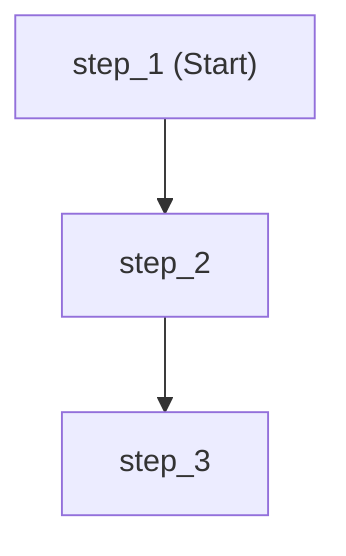
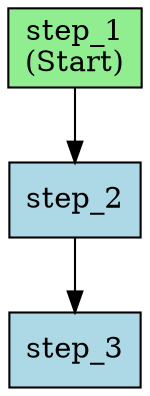
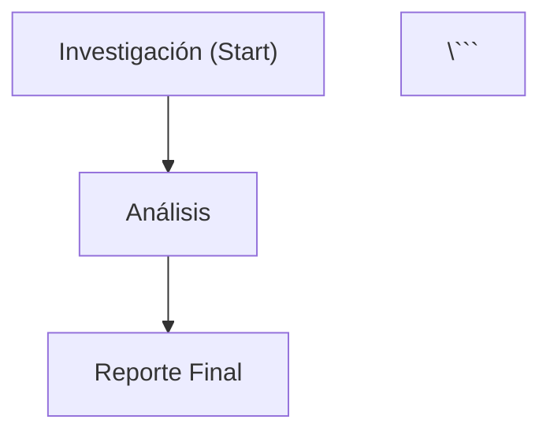

# Guía Completa: Visualización y Debugging de Workflows en Agent Framework

## 📋 Resumen

Agent Framework incluye herramientas integradas para visualizar y hacer debugging de workflows. Esta guía cubre todas las capacidades disponibles.

---

## 🎨 1. WorkflowViz - Visualización de Workflows

`WorkflowViz` es la clase principal para generar representaciones visuales de tus workflows.

### Importación

```python
from agent_framework import WorkflowViz
```

### Uso Básico

```python
# Crear workflow
workflow = (
    WorkflowBuilder()
    .set_start_executor(step_1)
    .add_edge(step_1, step_2)
    .add_edge(step_2, step_3)
    .build()
)

# Crear visualizador
viz = WorkflowViz(workflow)
```

---

## 📊 2. Métodos de Visualización

### 2.1 Diagrama Mermaid (`to_mermaid()`)

**Uso ideal:** Documentación en GitHub, GitLab, Markdown

```python
mermaid_diagram = viz.to_mermaid()
print("```mermaid")
print(mermaid_diagram)
print("```")
```

**Salida:**


**Ventajas:**
- ✅ Se renderiza automáticamente en GitHub/GitLab
- ✅ Fácil de versionar en código
- ✅ No requiere dependencias externas
- ✅ Ideal para documentación técnica

---

### 2.2 Diagrama Graphviz DOT (`to_digraph()`)

**Uso ideal:** Procesamiento con Graphviz, personalización avanzada

```python
dot_diagram = viz.to_digraph()
print(dot_diagram)
```

**Salida:**


**Ventajas:**
- ✅ Formato estándar de Graphviz
- ✅ Altamente personalizable
- ✅ Compatible con muchas herramientas

---

### 2.3 Exportar a SVG (`export('svg')` o `.save_svg()`)

**Uso ideal:** Incrustar en web, documentación HTML, escalable

```python
# Método 1: export()
svg_path = viz.export(format='svg', filename='workflow.svg')

# Método 2: save_svg() (si existe)
svg_path = viz.save_svg('workflow.svg')
```

**Requisitos:**
- Python package: `graphviz>=0.20.0`
- Sistema: Graphviz instalado

**Instalación Windows:**
```bash
choco install graphviz
pip install graphviz>=0.20.0
```

**Ventajas:**
- ✅ Vectorial (escalable sin pérdida)
- ✅ Ligero
- ✅ Ideal para web

---

### 2.4 Exportar a PNG (`save_png()`)

**Uso ideal:** Presentaciones, emails, documentos

```python
png_path = viz.save_png('workflow.png')
```

**Requisitos:** Mismo que SVG

**Ventajas:**
- ✅ Fácil de compartir
- ✅ Compatible con todo
- ✅ No requiere visor especial

---

### 2.5 Exportar a PDF (`save_pdf()`)

**Uso ideal:** Documentación formal, reportes

```python
pdf_path = viz.save_pdf('workflow.pdf')
```

**Requisitos:** Mismo que SVG

**Ventajas:**
- ✅ Profesional
- ✅ Multi-página (workflows grandes)
- ✅ Imprimible

---

## 🐛 3. Workflow Events - Debugging en Tiempo Real

Agent Framework emite eventos durante la ejecución de workflows que puedes capturar para debugging, logging y monitoreo.

### Importación

```python
from agent_framework._workflows._events import (
    ExecutorInvokedEvent,
    ExecutorCompletedEvent,
    ExecutorFailedEvent,
    WorkflowStartedEvent,
    WorkflowOutputEvent,
    WorkflowFailedEvent,
    WorkflowWarningEvent,
    WorkflowErrorEvent,
    AgentRunEvent
)
```

### Eventos Disponibles

| Evento | Cuándo se emite | Información disponible |
|--------|-----------------|------------------------|
| `WorkflowStartedEvent` | Al inicio del workflow | - |
| `ExecutorInvokedEvent` | Cuando se invoca un executor | `executor_id`, `data` |
| `ExecutorCompletedEvent` | Cuando un executor termina | `executor_id`, `data` |
| `ExecutorFailedEvent` | Cuando un executor falla | `executor_id`, `error` |
| `WorkflowOutputEvent` | Output final del workflow | `data` |
| `WorkflowFailedEvent` | Cuando el workflow falla | `error` |
| `WorkflowWarningEvent` | Warnings durante ejecución | `message` |
| `WorkflowErrorEvent` | Errores durante ejecución | `message` |
| `AgentRunEvent` | Ejecución de agentes | Agent run info |

### Ejemplo de Debugging Completo

```python
async for event in workflow.run_stream("input"):

    # Inicio del workflow
    if isinstance(event, WorkflowStartedEvent):
        print(f"[START] Workflow iniciado")

    # Invocación de executor
    elif isinstance(event, ExecutorInvokedEvent):
        print(f"[INVOKE] {event.executor_id}")
        print(f"         Input: {event.data}")

    # Completación de executor
    elif isinstance(event, ExecutorCompletedEvent):
        print(f"[COMPLETE] {event.executor_id}")
        print(f"           Output: {event.data}")

    # Fallo de executor
    elif isinstance(event, ExecutorFailedEvent):
        print(f"[FAILED] {event.executor_id}")
        print(f"         Error: {event.error}")

    # Output final
    elif isinstance(event, WorkflowOutputEvent):
        print(f"[OUTPUT] {event.data}")

    # Fallo del workflow
    elif isinstance(event, WorkflowFailedEvent):
        print(f"[WORKFLOW FAILED] {event.error}")

    # Warnings y errores
    elif isinstance(event, WorkflowWarningEvent):
        print(f"[WARNING] {event.message}")

    elif isinstance(event, WorkflowErrorEvent):
        print(f"[ERROR] {event.message}")
```

---

## 📈 4. Casos de Uso Recomendados

### 4.1 Desarrollo Local

**Usar:**
- `WorkflowViz.to_mermaid()` - Para documentación rápida
- Workflow Events - Para debugging detallado

**Ejemplo:**
```python
# Visualizar workflow
viz = WorkflowViz(workflow)
print(viz.to_mermaid())

# Debugging con eventos
async for event in workflow.run_stream(input):
    if isinstance(event, ExecutorFailedEvent):
        print(f"ERROR en {event.executor_id}: {event.error}")
```

---

### 4.2 Documentación en GitHub

**Usar:**
- `WorkflowViz.to_mermaid()` - Se renderiza automáticamente

**Ejemplo en README.md:**
```markdown
## Arquitectura del Workflow



---

### 4.3 Presentaciones y Reportes

**Usar:**
- `WorkflowViz.save_png()` - Para slides
- `WorkflowViz.save_pdf()` - Para documentos formales

**Ejemplo:**
```python
viz = WorkflowViz(workflow)
viz.save_png('workflow_presentation.png')
viz.save_pdf('workflow_documentation.pdf')
```

---

### 4.4 CI/CD y Automatización

**Usar:**
- `WorkflowViz.export('svg')` - Generar diagramas en builds
- Workflow Events - Logging estructurado

**Ejemplo (GitHub Actions):**
```yaml
- name: Generate workflow diagrams
  run: |
    python generate_workflow_docs.py
    git add workflows/*.svg
```

**generate_workflow_docs.py:**
```python
from my_workflows import get_all_workflows
from agent_framework import WorkflowViz

for name, workflow in get_all_workflows().items():
    viz = WorkflowViz(workflow)
    viz.export('svg', filename=f'workflows/{name}.svg')
```

---

### 4.5 Monitoreo en Producción

**Usar:**
- Workflow Events + Logging estructurado
- Integración con Application Insights / Datadog

**Ejemplo:**
```python
import logging
import json

logger = logging.getLogger(__name__)

async for event in workflow.run_stream(input):

    # Log estructurado para analytics
    if isinstance(event, ExecutorCompletedEvent):
        logger.info("executor_completed", extra={
            "executor_id": event.executor_id,
            "duration_ms": event.duration,
            "success": True
        })

    elif isinstance(event, ExecutorFailedEvent):
        logger.error("executor_failed", extra={
            "executor_id": event.executor_id,
            "error": str(event.error),
            "success": False
        })
```

---

## 🔧 5. Instalación de Dependencias

### Básico (solo Mermaid y DOT)

```bash
# No requiere instalación adicional
# to_mermaid() y to_digraph() funcionan out-of-the-box
```

### Completo (SVG, PNG, PDF)

**Windows:**
```bash
# 1. Instalar Graphviz en sistema
choco install graphviz

# 2. Instalar paquete Python
pip install graphviz>=0.20.0
```

**macOS:**
```bash
# 1. Instalar Graphviz en sistema
brew install graphviz

# 2. Instalar paquete Python
pip install graphviz>=0.20.0
```

**Linux (Ubuntu/Debian):**
```bash
# 1. Instalar Graphviz en sistema
sudo apt-get install graphviz

# 2. Instalar paquete Python
pip install graphviz>=0.20.0
```

---

## 📚 6. Comparación de Formatos

| Formato | Tamaño | Escalable | Editable | Uso ideal |
|---------|--------|-----------|----------|-----------|
| **Mermaid** | Pequeño | ✅ | ✅ | GitHub, documentación |
| **DOT** | Pequeño | ✅ | ✅ | Procesamiento, personalización |
| **SVG** | Pequeño | ✅ | ⚠️ | Web, documentación HTML |
| **PNG** | Mediano | ❌ | ❌ | Presentaciones, emails |
| **PDF** | Grande | ✅ | ❌ | Reportes, documentación formal |

---

## 🎯 7. Mejores Prácticas

### ✅ DO

1. **Usar Mermaid por defecto** - Funciona sin dependencias
2. **Capturar eventos en producción** - Para monitoreo y debugging
3. **Versionar diagramas Mermaid** - Junto con el código
4. **Usar logging estructurado** - Con eventos de workflow
5. **Generar diagramas en CI/CD** - Mantener docs actualizadas

### ❌ DON'T

1. **No usar PNG para documentación** - Preferir Mermaid/SVG
2. **No ignorar eventos de error** - Siempre logearlos
3. **No hardcodear rutas** - Usar paths relativos
4. **No exportar a imagen sin Graphviz** - Verificar instalación primero

---

## 📖 8. Scripts de Ejemplo

### Script Completo

Ver: `022_workflow_visualization_debugging.py`

Este script demuestra:
- ✅ Todos los métodos de WorkflowViz
- ✅ Todos los eventos de workflow
- ✅ Manejo de errores
- ✅ Casos de uso recomendados

### Ejecutar Demo

```bash
uv run 022_workflow_visualization_debugging.py
```

---

## 🔗 9. Referencias

- **Agent Framework Docs**: https://microsoft.github.io/agent-framework/
- **Mermaid Syntax**: https://mermaid.js.org/
- **Graphviz**: https://graphviz.org/
- **Ejemplos en este repo**:
  - `012_sequential_workflow.py` - Workflow secuencial con viz
  - `013_sequential_workflow.py` - Workflow secuencial (cierre manual)
  - `014_parallel-workflow.py` - Workflow paralelo con viz
  - `022_workflow_visualization_debugging.py` - Demo completo

---

## ❓ 10. FAQ

**P: ¿Necesito instalar Graphviz?**
R: Solo si quieres exportar a SVG/PNG/PDF. Mermaid y DOT funcionan sin instalación.

**P: ¿Los eventos impactan el rendimiento?**
R: Mínimamente. Son eventos síncronos en memoria. Para producción, usa logging asíncrono.

**P: ¿Puedo personalizar los diagramas?**
R: Sí, especialmente el formato DOT. Mermaid tiene opciones limitadas.

**P: ¿Hay límite de tamaño para workflows?**
R: No hay límite técnico, pero workflows muy grandes pueden generar diagramas difíciles de leer.

**P: ¿Cómo integro con Application Insights?**
R: Usa el handler de logging de Azure. Ver `018_observability_telemetry.py`.

---

**Última actualización:** 2025-12-07
